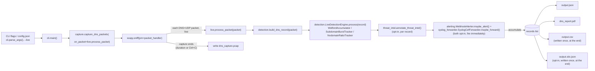

# DNSpector — Technical Documentation

This document is a deep dive into **how the tool actually works**, **the DNS/security theory behind the detection logic**, and a **roadmap of improvements** to turn this from a learning script into a portfolio-grade cybersecurity project. For install/run instructions, see [README.md](README.md).

---

## 1. How the Project Works (Code Walkthrough)

The implementation lives in the `dnspector/` package (split into modules during Phase 3, once the single-file layout from Phase 0/1/2 genuinely became unwieldy — see §3.2). `dnspector.py` at the repo root is now a thin backward-compatible shim that just calls into `dnspector.cli.main()`, so `python dnspector.py` and `python -m dnspector` behave identically.

| Module | Responsibility |
|---|---|
| `dns_parsing.py` | Pure DNS/domain parsing: `calculate_entropy`, `parse_domain`, `parse_dns_flags`, `format_flags` |
| `detection.py` | Per-packet + batch-level anomaly detection (`build_dns_record`, `apply_detection_signals`, `DetectionSettings`), plus streaming/incremental equivalents for live mode (`LiveDetectionEngine`, §1.3e) |
| `threat_intel.py` | OpenPhish/URLhaus/VirusTotal feed checks: `ThreatIntelChecker`, `apply_threat_intel`/`annotate_threat_intel`, `ThreatIntelSettings` |
| `alerting.py` | Severity classification + webhook alerting: `classify_severity`, `WebhookAlerter`, `AlertSettings` (§1.3f) |
| `syslog_forwarder.py` | CEF formatting + syslog forwarding: `format_cef`, `SyslogCefForwarder`, `SyslogSettings` (§1.3h) |
| `export.py` | CSV + STIX 2.1 export: `generate_csv_report`, `build_stix_bundle`/`write_stix_bundle` (§1.3g) |
| `capture.py` | Packet capture: `capture_dns_packets` (batch, or with an inline `on_packet` callback for live mode) |
| `analysis.py` | Orchestrates the batch pipeline: `analyze_pcap` |
| `live.py` | Orchestrates the live/streaming pipeline: `capture_and_detect_live` (§1.2a) |
| `report.py` | PDF rendering: `generate_pdf_report` |
| `config.py` | JSON config file loading: `load_config` |
| `cli.py` | `argparse` setup and the `main()` entry point |

The tool runs in two sequential phases — **capture**, then **analysis** — either as a **batch** (the default: analysis only starts once capture finishes) or **live** (`--live`: analysis and alerting happen inline as each packet is captured). Both are orchestrated by `main()` (in `cli.py`); §1.2 covers batch, §1.2a covers live.

```mermaid
flowchart LR
    A["CLI flags / config.json\ncli.parse_args()"] --> M["cli.main()"]
    M --> B["capture.capture_dns_packets()\nscapy.sniff(filter='udp port 53')"]
    B --> C[packet_handler closure filters\nDNS+UDP packets into memory]
    C --> D["wrpcap()\ndns_capture.pcap"]
    D --> E["analysis.analyze_pcap()\nrdpcap() reloads the file"]
    E --> F["Pass 1: per-packet loop\ndetection.build_dns_record(packet)"]
    F --> G["dns_parsing.parse_domain() +\ncalculate_entropy(scoring_label)"]
    F --> H["dns_parsing.parse_dns_flags(dns)"]
    F --> P["Pass 2: detection.apply_detection_signals(records)"]
    P --> Z["compute_host_baselines()\n+ entropy_z_score()"]
    P --> BU["detect_subdomain_bursts()"]
    P --> NX["compute_nxdomain_ratios()"]
    Z --> I["generate_remark(...)"]
    BU --> I
    NX --> I
    I --> TI["Pass 3 (opt-in): threat_intel.apply_threat_intel()\nOpenPhish / URLhaus / VirusTotal"]
    TI --> AL["Pass 4: severity classification +\nalerting.WebhookAlerter (opt-in) +\nsyslog_forwarder.SyslogCefForwarder (opt-in)"]
    AL --> J["output.json"]
    AL --> K["dns_report.pdf via report.generate_pdf_report()"]
    AL --> CSV["output.csv via export.generate_csv_report()"]
    AL --> STIX["output.stix.json via export.write_stix_bundle()\n(opt-in, --export-stix)"]
```



`--live` (§1.2a) replaces the capture-then-analyze split above with inline processing - each packet goes straight through detection (and threat-intel/alerting, if enabled) as it's captured, using `LiveDetectionEngine`'s incremental algorithms instead of the batch functions:



### 1.1 Capture phase

- `capture.capture_dns_packets(duration, iface, pcap_file, on_packet=None)` uses Scapy's `sniff()` with a **BPF filter** `udp port 53`, so the OS-level packet filter — not Python — discards all non-DNS traffic before it ever reaches the script. This requires raw-socket access (root/administrator privileges, or `CAP_NET_RAW` on Linux); a `PermissionError`/`OSError` here is caught, logged with actionable guidance, and turned into a clean `exit(1)` instead of a raw traceback (see §1.3b).
- The `packet_handler` callback Scapy invokes per captured packet is a **closure** local to `capture_dns_packets` (not a module-level global) — it double-checks the packet actually has both a `DNS` and `UDP` layer, appends it to a list scoped to that capture run, and (Phase 4) calls the optional `on_packet` callback synchronously if one was given. Keeping it a closure means running capture twice in the same process (e.g. in tests) can't leak state between runs.
- `on_packet` (Phase 4) is how `live.py`'s inline pipeline (§1.2a) plugs into the same, already-tested capture/error-handling code instead of duplicating it - the only difference between batch and live capture is whether this callback is set. It runs on the capture thread, so anything slow in it (a webhook call, say) delays processing of the next packet - `WebhookAlerter`'s network call is the one place this matters (see §1.4).
- `duration <= 0` means capture indefinitely, passed to `sniff()` as `timeout=None`, until interrupted with Ctrl+C. Scapy's `sniff()` catches `KeyboardInterrupt` internally and returns the packets captured so far rather than propagating it, so this stops cleanly - useful for open-ended `--live` monitoring.
- After capture ends, if any packets were captured, `wrpcap()` writes them to `dns_capture.pcap` (or `--pcap-file`) — a **standard pcap file**, so it's also readable in Wireshark/tcpdump for manual inspection. If nothing was captured, a warning is logged and `main()` skips the analysis phase entirely rather than trying to analyze an empty/missing file.

### 1.1a CLI, config file, and logging

- `cli.parse_args()` builds an `argparse` parser with `--duration`, `--iface`, `--output-dir`, `--entropy-threshold`, plus the Phase 2 detection-threshold flags, the Phase 3 threat-intel flags (§1.3d), and the Phase 4 `--live`/`--enable-alerts`/`--webhook-url`/`--alert-min-severity` flags (§1.2a/§1.3f). Run `python dnspector.py --help` for the full list.
- `--config <path>` points at a JSON file (see `config.example.json`) whose keys become the *defaults* for every other flag. Precedence is **CLI flag > config file > built-in default** — implemented via a two-pass parse: a lightweight `pre_parser` extracts just `--config` first (via `parse_known_args`), `config.load_config()` reads it, and those values seed the real parser's `default=` arguments before the full `argv` is parsed again.
- All logging goes through Python's `logging` module. Each module gets its own logger via `logging.getLogger(__name__)` (e.g. `dnspector.capture`, `dnspector.threat_intel`) — standard hierarchical-logger practice, so log lines are traceable to their module and could be filtered per-module if needed. `cli.main()` configures the root handler once via `logging.basicConfig(level=..., format=...)` based on `--log-level`; every module's logger propagates up to it.

### 1.2 Analysis phase (batch mode - the default)

`analysis.analyze_pcap(pcap_file, json_file, report_file, settings, threat_intel_checker, alerter, csv_file, stix_file, syslog_forwarder)` re-reads the pcap from disk (decoupling capture from analysis — you could swap in any pcap, not just one you just captured) and runs it through **up to five steps**:

**Pass 1 — per-packet parsing.** For every DNS+UDP packet, `detection.build_dns_record(packet, entropy_threshold)` — a **pure function** — extracts `source_ip`/`destination_ip` from the IP layer, pulls the queried domain from the DNS Question section (`DNSQR.qname`), splits it into public-suffix-aware parts via `dns_parsing.parse_domain()`, scores entropy over the registrant-controlled label only (`calculate_entropy(domain_parts.scoring_label)`), and decodes the header flags via `parse_dns_flags()`. It returns `None` (and the packet is skipped, with a count logged afterward) if the packet has no IP layer — e.g. non-IPv4 traffic — rather than raising a `KeyError` (see §1.3b). The remark it sets is only a *provisional* one based on the fixed entropy threshold and flags.

**Pass 2 — batch-level detection signals.** Once every packet has been parsed into a record, `detection.apply_detection_signals(records, settings)` (§1.3c) computes per-host entropy baselines, subdomain-burst groups, and per-client NXDOMAIN ratios across the *whole* batch, then re-derives each record's `remark` — this can only happen after Pass 1, since e.g. a per-host baseline needs every query from that host to be parsed first.

**Pass 3 — threat intel (opt-in, only if a `threat_intel_checker` is passed).** `threat_intel.apply_threat_intel(records, checker)` (§1.3d) checks each record's registrable domain against OpenPhish/URLhaus/VirusTotal and appends a further note to `remark` on a confirmed match. This is a separate pass, not folded into Pass 2, because it's the only one that does real network I/O — keeping it isolated is what lets Pass 1/2 stay pure and fast to unit-test, and lets Pass 3 be skipped entirely (the default) without touching the rest of the pipeline.

**Pass 4 — severity + alerting/forwarding (opt-in, only if `alerter`/`syslog_forwarder` are passed).** Every record gets `record["severity"] = alerting.classify_severity(record)` (§1.3f) regardless of whether alerting is on - it's useful metadata for the JSON/CSV output either way (e.g. for a downstream SIEM). If an `alerter` was passed, `alerter.maybe_alert(record)` fires a webhook for anything at or above `--alert-min-severity`; if a `syslog_forwarder` was passed, `syslog_forwarder.maybe_forward(record)` (§1.3h) does the same for `--syslog-min-severity`, once analysis is complete. For alerts/forwards that go out the moment an anomaly is *observed* instead, use `--live` (§1.2a).

**Pass 5 — exports (`report.generate_pdf_report()` always; `export.generate_csv_report()` if `csv_file` is given; `export.write_stix_bundle()` if `stix_file` is given, §1.3g).** The PDF is drawn from the final, fully-annotated records: a block of text per record into a `reportlab` canvas, paginating (`c.showPage()`) once `y_position` runs below `y=100`. The CSV flattens each record's nested `flags`/`threat_intel` dicts into prefixed columns. The STIX bundle contains one Indicator object per unique domain a threat-intel provider confirmed malicious - empty (but still valid) if nothing was flagged. Finally, the records list is dumped to `output.json`. Keeping `build_dns_record()`/`apply_detection_signals()`/`export.flatten_record()`/`export.build_stix_bundle()` free of I/O (network, disk, `reportlab`) is what makes them unit-testable with plain dicts and fake packets (see `tests/test_detection.py`, `tests/test_export.py`).

### 1.2a Analysis phase (live mode - `--live`, Phase 4)

`live.capture_and_detect_live(duration, iface, pcap_file, json_file, report_file, settings, threat_intel_checker, alerter, csv_file, stix_file, syslog_forwarder)` is the streaming equivalent of `analyze_pcap()`. Instead of capture-then-five-steps, it registers a single `process_packet` callback as `capture_dns_packets()`'s `on_packet` (§1.1) and runs the *entire* per-record pipeline inline, the moment each packet is captured:

1. `detection.build_dns_record(packet, entropy_threshold)` — identical to batch Pass 1, unchanged.
2. `detection.LiveDetectionEngine.process(record)` (§1.3e) — the streaming equivalent of batch Pass 2 (`apply_detection_signals()`), using incremental algorithms (Welford's online mean/variance, a sliding-window burst tracker, a running NXDOMAIN counter) instead of a full-batch rescan, since there's no "full batch" available yet in a live capture.
3. `threat_intel.annotate_threat_intel(record, checker)` (opt-in) — the single-record version of batch Pass 3's `apply_threat_intel()`; both call the same underlying `ThreatIntelChecker.check()`, so caching/rate-limiting behavior is identical in both modes.
4. `record["severity"] = classify_severity(record)`, then `alerter.maybe_alert(record)` and `syslog_forwarder.maybe_forward(record)` (both opt-in) — identical logic to batch Pass 4, just invoked per-record instead of once at the end. This is the actual payoff of live mode: an alert/syslog message for a DNS-tunneling burst fires on the packet that crosses the threshold, not after the whole capture window closes.

Every processed record is appended to an in-memory list; once capture ends (duration elapses, or Ctrl+C on an indefinite capture), that list is written to `output.json`, rendered to `dns_report.pdf`, and (unlike per-record alerting/forwarding) the CSV/STIX exports are written **once, at the end** — they're whole-batch artifacts by nature (a CSV row-per-record dump, a deduplicated STIX bundle), so there's no meaningful "inline" version of them the way there is for a single-record alert. This is **the exact same output shape as batch mode**, so downstream tooling doesn't need to know which mode produced a given report. The underlying per-record functions (`build_dns_record`, `annotate_threat_intel`, `classify_severity`) are literally shared between `analysis.py` and `live.py` - only the *aggregation* step (batch vs. incremental) differs. See §1.4 for the one place batch and live are numerically inconsistent (entropy z-scores) and why that's an intentional tradeoff, not a bug.

### 1.3 The detection logic, function by function

**`dns_parsing.calculate_entropy(domain)`** — implements **Shannon entropy**:

```
H(X) = -Σ p(x) log2 p(x)
```

For each unique character in the domain string, it computes that character's frequency as a probability and sums `-p·log2(p)` across all of them. A domain with few repeated characters scores high; a domain with a lot of repetition or a small alphabet scores low.

**`dns_parsing.parse_domain(domain)`** (Phase 2) — uses [`tldextract`](https://github.com/john-kurkowski/tldextract) (configured with `suffix_list_urls=()`, so it only ever consults its bundled Public Suffix List snapshot — no network calls, fully deterministic) to split a domain into `registrable_domain` (e.g. `evil-corp.co.uk` — correctly handling multi-label suffixes, which a naive "split on the last two dots" approach gets wrong), `subdomain` (e.g. `a1b2c3.tunnel`), and `scoring_label` — everything except the public suffix, which is what `calculate_entropy()` is actually run over. This directly addresses the "entropy diluted by a fixed low-entropy TLD" limitation from Phase 0/1: a DGA domain's randomness lives in the registrable-domain label, and a tunneling client's randomness lives in the subdomain — the suffix contributes nothing but noise to the score either way.

**`dns_parsing.parse_dns_flags(dns)`** — translates the raw numeric DNS header fields into readable strings: `QR` (query vs. response), `Opcode`, `AA` (authoritative answer), `TC` (truncated), `RD`/`RA` (recursion desired/available), and `RCODE` (response/error code, e.g. `NOERROR`, `REFUSED`). Opcode/RCODE names are resolved via the `OPCODES`/`RCODES` dicts with an `UNKNOWN(<value>)` fallback for any value outside the commonly-used range, so a malformed or non-standard packet degrades gracefully instead of crashing the run (see §1.4a).

#### 1.3a Fixed: opcode/rcode crash on uncommon values

The original implementation looked up `dns.opcode` and `dns.rcode` by indexing into fixed-size lists (`["QUERY", "IQUERY", "STATUS", "RESERVED"][dns.opcode]`, and similarly a 7-element list for RCODE). The DNS spec defines opcodes and RCODEs across the range 0–15, so any packet — malformed, crafted, or simply using a less common value like `NOTIFY` (opcode 4) or `NXRRSET` (RCODE 8) — would raise an `IndexError` and abort the entire analysis pass partway through. This has been fixed by replacing both lookups with `OPCODES`/`RCODES` dicts and `.get(value, f"UNKNOWN({value})")`, so unrecognized values are labeled instead of crashing. Regression tests for this live in `tests/test_dns_parsing.py::TestParseDnsFlags` (`test_uncommon_opcode_does_not_crash`, `test_extended_rcode_does_not_crash`, and the exhaustive `test_all_defined_*` cases). `calculate_entropy` was also hardened to return `0.0` for an empty domain instead of dividing by zero.

**`detection.generate_remark(entropy, flags, entropy_threshold, z_score, z_score_threshold)`** — a small rule-based classifier:

| Condition | Verdict |
|---|---|
| entropy > entropy_threshold | "High entropy domain name — Possible DGA or DNS Tunneling" |
| `z_score` is not `None` and `z_score` > `z_score_threshold` | "Entropy anomalous for this host (z=…) — Possible DGA or DNS Tunneling" |
| `rcode == REFUSED` | "DNS query refused by the server" |
| response with non-`NOERROR` rcode | "Unsuccessful DNS response — Possible misconfiguration or attack" |
| otherwise | "Normal query" |

`z_score` defaults to `None`, so calling this with just `(entropy, flags)` behaves exactly as it did before Phase 2 — the z-score branch is additive, not a replacement for the fixed threshold (both stay active; see §1.3c for why). This function only produces the *per-packet* verdict — `apply_detection_signals()` appends further notes (burst/NXDOMAIN) on top of whatever this returns.

#### 1.3b Fixed: crashes on realistic failure modes (Phase 1)

The original script had no error handling at all — three genuinely likely failure modes each produced an unhandled exception and a raw traceback instead of a usable error message:

- **No capture permissions.** `sniff()` needs raw-socket access; without it, `capture_dns_packets()` now catches `PermissionError`/`OSError`, logs guidance ("try running with sudo, or grant CAP_NET_RAW"), and `main()` exits with code `1` instead of a traceback.
- **Missing/corrupt pcap file.** `analyze_pcap()` now explicitly checks the file exists (raising a clear `FileNotFoundError` if not) and wraps `rdpcap()` in a `try/except` that re-raises a `ValueError` with context if the file can't be parsed. `main()` catches both and logs+exits cleanly.
- **Packet with no IP layer.** Previously `packet[IP].src` would raise `KeyError` on any non-IPv4 DNS traffic. `build_dns_record()` now checks `packet.haslayer(IP)` first and returns `None`, which `analyze_pcap()` counts and skips instead of crashing the whole run.

Regression tests for these live in `tests/test_detection.py::TestBuildDnsRecord`, plus `tests/test_config.py::TestLoadConfig` and `tests/test_cli.py::TestParseArgs` for the related CLI/config plumbing, and `tests/test_analysis.py::TestAnalyzePcapEndToEnd` for the missing/corrupt-pcap paths against a real `analyze_pcap()` call.

#### 1.3c Added: batch-level detection signals (Phase 2)

A single packet, in isolation, can't tell you whether *this host* usually queries high-entropy domains, whether *this parent domain* is being hit with an unusual number of unique subdomains, or whether *this client* has an abnormal NXDOMAIN rate — those all require looking at the whole capture at once. `apply_detection_signals(records, settings)` runs three independent analyses over the full batch of Pass-1 records and folds the results back into each record's `remark`:

- **`compute_host_baselines(records, min_samples)`** — for every source host that sent at least `min_samples` (default 5) `QUERY` records, computes the mean and population standard deviation of that host's entropy values (`statistics.mean`/`statistics.pstdev`), returned as a `HostEntropyBaseline`. Hosts below the sample threshold get no baseline at all (too little data for a stable estimate) rather than a misleading one.
- **`entropy_z_score(entropy, baseline)`** — standard z-score, `(entropy - mean) / stdev`; returns `None` if there's no baseline for that host or if the baseline has zero variance (a constant baseline can't produce a meaningful deviation). `generate_remark()` flags anything above `--z-score-threshold` (default 3.0 — the standard "3-sigma" outlier convention) as anomalous *for that specific host*, which is a materially different (and more defensible) claim than "this domain looks weird in general."
- **`detect_subdomain_bursts(records, window_seconds, unique_threshold)`** — buckets `QUERY` records by `(registrable_domain, floor(timestamp / window_seconds))` and collects the set of unique subdomain labels queried in each bucket. A bucket with `unique_threshold` (default 15) or more unique subdomains under one parent domain gets flagged — this is the query-frequency/burst signal from §2.2, and it fires independently of any single query's entropy (a burst of *low*-entropy-looking-individually subdomains under one domain is still suspicious in aggregate).
- **`compute_nxdomain_ratios(records, min_samples)`** — for every **client** that received at least `min_samples` (default 5) DNS responses, computes what fraction came back `NXDOMAIN`. Important subtlety: on a `RESPONSE` packet, the *client* is `destination_ip`, not `source_ip` (the source is the answering DNS server) — getting this backwards would silently baseline the wrong host. A ratio above `--nxdomain-ratio-threshold` (default 0.5) is flagged as a possible DGA client cycling through candidate C2 domains.

All four functions are pure (take/return plain dicts and primitives, no I/O), which is what makes them independently unit-testable via a small `make_record()` test fixture instead of needing real scapy packets or pcap files (see `TestComputeHostBaselines`, `TestEntropyZScore`, `TestDetectSubdomainBursts`, `TestComputeNxdomainRatios`, and the integration-style `TestApplyDetectionSignals` in `tests/test_detection.py`). All the new thresholds are configurable via CLI flags or `config.example.json` (bundled into a `DetectionSettings` dataclass rather than passed as five separate parameters, to keep `analyze_pcap()`'s signature from ballooning as Phase 3 adds more).

#### 1.3d Added: threat-intel feed integration (Phase 3)

`threat_intel.py` checks a record's `registrable_domain` against real-world known-bad-domain feeds, turning a heuristic "looks suspicious" verdict into a confirmed "is on a real-world blocklist" one — the gap named in §2.4. It's **off by default** (`--enable-threat-intel`) and layered on as an optional Pass 3 (§1.2), for two reasons: it's the only part of the pipeline that does real network I/O, and enabling it means sending every domain your capture observes to third-party services — a privacy/opsec tradeoff that should never be silent default behavior for a tool that may be monitoring sensitive traffic.

- **`ThreatIntelChecker.check(registrable_domain)`** tries each enabled provider **in order** — URLhaus, then OpenPhish, then VirusTotal — stopping at the first confirmed-malicious verdict. A provider that errors (timeout, HTTP error, malformed response) logs a warning and is treated as inconclusive, falling through to the next one rather than failing the whole check — threat intel is a bonus signal on top of the local heuristics, never a hard dependency the rest of the pipeline can be broken by.
- **`IOCCache`** is a small TTL cache (`--threat-intel-cache-ttl-seconds`, default 1 hour) keyed by registrable domain, and — deliberately — caches **both** malicious *and* clean verdicts. Caching only positives would miss most of the benefit: most observed domains are clean, and the same clean domain (e.g. `google.com`) can appear dozens of times in one capture.
- **`OpenPhishFeed`** downloads the free OpenPhish active-phishing feed (plain-text list of URLs, no API key needed) and refreshes it at most once per hour, parsing each URL's hostname down to a registrable domain via `dns_parsing.parse_domain()` for consistent matching against the rest of the pipeline. Membership is then a simple set lookup.
- **A real integration gotcha, found by testing the live API while building this**: URLhaus (abuse.ch) looks keyless in older documentation, but as of 2025 every request needs an `Auth-Key` header from a free account at `auth.abuse.ch` — calling it with no key returns a plain `401`, and with an invalid key returns `403 {"query_status": "unknown_auth_key"}`. Rather than ship an integration that silently 401s forever, `ThreatIntelChecker` checks `settings.urlhaus_api_key` is set *before* attempting a URLhaus call at all — no key means URLhaus is skipped cleanly, falling through to OpenPhish, instead of wasting a request (and a log line) on a call that can never succeed. VirusTotal needs an API key too (its free tier is documented as needing one, so this wasn't a surprise) and is additionally rate-limited client-side: `virustotal_min_interval_seconds` (default 15s, matching VT's ~4-requests/minute free-tier limit) and `virustotal_max_lookups_per_run` (default 20) bound how often and how many times VT gets called in one run — by **skipping** (not blocking/sleeping) once the limit is hit, so a run with many unique domains stays bounded in wall-clock time rather than potentially stalling for minutes.
- All three provider fetchers (`_fetch_urlhaus`, `_fetch_openphish_feed`, `_fetch_virustotal`) are small, injectable functions — `ThreatIntelChecker`/`OpenPhishFeed` take them as constructor arguments with real-network defaults, so `tests/test_threat_intel.py` exercises the full order-of-providers/caching/rate-limiting logic with fake fetchers and a fake clock (`FakeClock`, an injectable `now_fn`), with **zero real network calls and zero real sleeping** — the whole 20-case test file runs in milliseconds. The real fetchers were separately verified by hand against the live APIs while building this (see `tests/test_analysis.py` for the synthetic end-to-end test, and the git history for the manual verification session).

#### 1.3e Added: streaming/incremental detection primitives (Phase 4)

Batch mode's `compute_host_baselines()`/`detect_subdomain_bursts()`/`compute_nxdomain_ratios()` (§1.3c) all need the *entire* set of records in memory to compute a statistic — fine for "analyze this pcap," impossible for "detect this as it happens." `detection.LiveDetectionEngine` reimplements the same three signals as **online algorithms** that update in O(1)-ish time and memory per record, deliberately reusing `HostEntropyBaseline`, `entropy_z_score()`, `NxdomainStats`, and `generate_remark()` from the batch code so both modes share the same scoring logic — only *how* the baseline/window/ratio is computed differs:

- **`WelfordAccumulator`** — [Welford's online algorithm](https://en.wikipedia.org/wiki/Algorithms_for_calculating_variance#Welford's_online_algorithm) for streaming mean/variance, the standard technique for computing a running mean and variance without storing every sample seen so far (only three running numbers: count, mean, and the sum of squared deviations `M2`). One per source host, created lazily.
- **`SubdomainBurstTracker`** — a genuine **sliding window** per registrable domain (a `deque` of `(timestamp, subdomain)` pairs, evicting anything older than `window_seconds` on every observation), rather than batch mode's fixed time buckets. This is actually a *better* algorithm than the batch version — it doesn't have the hard-bucket-boundary problem documented as a batch-mode limitation (§1.4) — but wasn't backported to batch mode in this pass, to avoid destabilizing well-tested Phase 2 code for a phase that wasn't asking for it.
- **`NxdomainRatioTracker`** — a simple running `[nxdomain_count, total_count]` per client, cumulative for the life of the tracker (i.e. for the whole live session) - the direct streaming analogue of the batch version's per-run aggregation.
- **A deliberate, documented difference from batch mode**: `LiveDetectionEngine.process()` scores a record's entropy against the host's baseline **before** folding that record into the baseline (`accumulator.update()` happens after `entropy_z_score()`). Batch mode's `compute_host_baselines()` computes each host's baseline from *every* record for that host, including the one being scored — which numerically dampens an outlier's own effect on its mean/stdev. Scoring against prior history only is both the standard approach for online anomaly detection and the only causally sensible one for a real stream (you can't include a data point in a baseline before it's been fully processed) - but it means live and batch mode can produce a *different* z-score for the same underlying data. This is called out as a known limitation (§1.4), not silently glossed over.

All three classes are pure/in-memory (no I/O), so `tests/test_detection.py`'s `TestWelfordAccumulator`/`TestSubdomainBurstTracker`/`TestNxdomainRatioTracker`/`TestLiveDetectionEngine` exercise them directly — including a test that explicitly locks in the "score-before-update" ordering above, so a future refactor can't silently flip it back to batch-style semantics.

#### 1.3f Added: severity classification and webhook alerting (Phase 4)

`alerting.py` turns a record's `remark` (and `threat_intel` verdict) into an actionable **severity** level, and optionally fires a webhook for anything at or above a configured threshold:

- **`classify_severity(record)`** maps a record to one of `info` / `medium` / `high` / `critical`, by re-reading the fields the detection/threat-intel passes already computed — a confirmed threat-intel match is always `critical` (regardless of what else is true about the record); DGA/tunneling/z-score-anomaly/burst/NXDOMAIN-ratio remarks are `high`; refused/misconfigured responses are `medium`; everything else is `info`. Deliberately built on the *already-computed* `remark` string rather than re-deriving its own thresholds, so severity classification can't silently drift out of sync with `generate_remark()`'s own logic (the two are always talking about the same evidence).
- **`WebhookAlerter.maybe_alert(record)`** sends a JSON payload to a Slack- or Discord-compatible incoming webhook URL if `classify_severity(record)` meets `--alert-min-severity` (default `high`). The payload includes both `"text"` (Slack's field name) and `"content"` (Discord's) with the same message, so one payload shape works for either platform without a separate "webhook style" setting — both ignore keys they don't recognize.
- **Fails open, like threat intel.** A webhook timeout or HTTP error is logged as a warning and swallowed — `maybe_alert()` still returns the classified severity (so the caller's log line still reports what was found), it just means the *notification* didn't go out. Alerting is a side effect layered on top of detection, never something detection depends on succeeding.
- **Alerting is available in both modes**, via the exact same `WebhookAlerter`/`classify_severity` — batch mode (`analysis.py`) calls `maybe_alert()` once per record during Pass 4, before the Pass 5 exports; live mode (`live.py`) calls it inline, the moment each record is finalized. The value proposition of `--live --enable-alerts` specifically is that the alert fires *while the anomaly is happening*, not after a capture window you had to wait out.
- `sender` (in `WebhookAlerter`) and `fetch_fn`/`urlhaus_fetcher`/`virustotal_fetcher` (in `ThreatIntelChecker`) follow the same injectable-function pattern, which is why `tests/test_alerting.py` can exercise real severity/threshold/error-handling logic with **zero real network calls or webhook endpoints**.

#### 1.3g Added: CSV and STIX export (Phase 5)

`export.py` holds two independent, pure "records in, file out" converters - no network I/O, unlike `threat_intel.py`/`alerting.py`/`syslog_forwarder.py` - which is why they're a separate module from those (mirroring `report.py`'s already-established pure-output role):

- **`generate_csv_report(records, csv_file)`** writes every record as a flat CSV row via `flatten_record()`, which prefixes the nested `flags`/`threat_intel` dicts' keys (`flags_qr`, `flags_rcode`, `threat_intel_is_malicious`, ...) since CSV has no concept of a nested value. Written by default (`--csv-file output.csv`) alongside JSON/PDF - no opt-in flag, since it's a local file with no network/privacy implications, unlike threat-intel or alerting.
- **`build_stix_bundle(records)`** produces a [STIX 2.1](https://oasis-open.github.io/cti-documentation/) bundle - the industry-standard structured-threat-information format most threat-intel-sharing tooling (MISP, OpenCTI, TAXII servers) can ingest - with one `indicator` Domain Object per unique `registrable_domain` a threat-intel provider confirmed malicious (deduplicated; empty objects list, still a valid bundle, if nothing was flagged). Each indicator's `id` is a **deterministic UUID5** (`uuid.uuid5(uuid.NAMESPACE_DNS, domain)`) rather than a random UUID4, so re-running the export for the same domain produces the same indicator id instead of a fresh one each time - useful if the bundle is fed into something that dedupes by id. Opt-in via `--export-stix`, since it's only meaningful alongside `--enable-threat-intel`.
- **Deliberately minimal STIX**, by design: a real STIX producer would typically also emit an `identity` SDO for the tool itself (`created_by_ref`), a `marking-definition` (e.g. TLP), and possibly a `relationship` to a `malware`/`threat-actor` object. This integration only emits what's directly derivable from a `ThreatIntelVerdict` - inventing the rest would mean fabricating data this tool doesn't actually have.

#### 1.3h Added: syslog/CEF forwarding (Phase 5)

`syslog_forwarder.py` formats records as [CEF](https://www.microfocus.com/documentation/arcsight/arcsight-smartconnectors/pdfdoc/common-event-format-v25/common-event-format-v25.pdf) (Common Event Format) - the format most SIEMs (Splunk, QRadar, ArcSight, and general syslog-CEF listeners) parse out of the box - and forwards them over syslog, mirroring `alerting.py`'s design almost exactly:

- **`format_cef(record, severity)`** builds a single CEF line: a 7-field pipe-delimited header (`CEF:0|DNSpector|dnspector|<version>|dns-anomaly|<name>|<severity 0-10>`) followed by space-separated `key=value` extension fields (`src`, `dst`, `request`, `msg`, plus custom `cs1`/`cn1`/`cs2` fields for the registrable domain, entropy, and severity label). CEF has its own escaping rules, different for header vs. extension fields (`_cef_escape_header`/`_cef_escape_extension`) - a literal `|` or `\` in a header field, or `=` or `\` in an extension value, has to be backslash-escaped or it would corrupt the message's field boundaries for the receiving parser.
- **`SyslogCefForwarder.maybe_forward(record)`** — same shape as `WebhookAlerter.maybe_alert()`: checks the record's severity against a configured minimum, sends via an injectable function if it qualifies, and fails open (logs a warning, doesn't raise) on a network error. One real difference: `--syslog-min-severity` **defaults to `info`** (forward everything), not `high` like `--alert-min-severity` - the point of a SIEM feed is usually full-fidelity event history for later search/correlation, not just the loud stuff a human needs to see immediately.
- **Holds a real resource (a socket)**, unlike the other injectable-network patterns in this project - `logging.handlers.SysLogHandler` opens a UDP or TCP connection at construction time (when no `sender` is injected). `SyslogCefForwarder.close()` releases it; `cli.main()` calls this in a `finally` block so the socket doesn't leak if the pipeline function raises partway through. Constructing a `SyslogCefForwarder` with no host configured and no injected `sender` is a deliberate no-op (never opens a real socket) rather than raising, so tests and library callers can safely construct one speculatively and check `settings.host` before deciding whether to use it.

### 1.4 Known limitations / rough edges (worth knowing before you demo this)

- **Baselines are still fixed-threshold-first.** The global `--entropy-threshold` check still runs *before* the per-host z-score check (see the table in §1.3), so an operator who sets it too low will still get false positives that per-host baselining alone would have avoided. It's a deliberate safety net (don't let a genuinely extreme value slip through just because it matches a host's own noisy baseline), but it means the two signals aren't purely additive.
- **Baselining and burst detection only see one capture (or one live session) at a time.** Nothing persists across separate *runs* of the tool (batch or live) — restart it and every host's baseline/burst-window/NXDOMAIN-ratio state resets to zero. A slow, low-and-slow tunneling client that stays under the threshold within any single run would be missed even if it's clearly anomalous across many runs. True cross-run persistence (a database or on-disk state file) is a further-out idea, not attempted here.
- **Time-window bucketing is a hard boundary in batch mode.** `detect_subdomain_bursts()` buckets by `floor(timestamp / window_seconds)`, so a burst that straddles a bucket boundary can be split across two buckets and each half might fall under the unique-subdomain threshold even though the full burst wouldn't. Live mode's `SubdomainBurstTracker` (§1.3e) already fixes this with a genuine sliding window — the fix wasn't backported to batch mode in this pass, so the two modes' burst detection isn't quite the same algorithm.
- **Live and batch mode can disagree on entropy z-scores for the same data.** As documented in §1.3e: live mode scores each record against its host's baseline *before* folding that record in, batch mode scores every record against a baseline computed from the whole batch *including itself*. Both are principled choices (the former is causally required for a stream; the latter is standard for a batch statistic), but don't expect identical z-scores re-running the same pcap through `--live` vs. the default batch mode.
- **`min_baseline_samples`/`min_nxdomain_samples` mean short captures get weaker detection.** A host that only sends 2-3 queries in a short demo capture won't get a z-score baseline or an NXDOMAIN ratio at all (falls back to the fixed threshold only) — this is intentional (too little data for a stable estimate) but worth knowing when demoing on a short capture window. In `--live` mode this also means the *first* few queries from any host are necessarily unbaselined, no matter how long the session eventually runs.
- **Threat intel needs API keys to be more than OpenPhish-only.** With `--enable-threat-intel` and no keys set, only the free OpenPhish feed is actually checked — URLhaus and VirusTotal both silently skip themselves (by design, see §1.3d) rather than fail loudly, which means it's easy to think you have three-provider coverage when you actually have one. Worth checking the "Threat-intel checks enabled (...)" log line at startup to confirm which providers are actually active.
- **OpenPhish coverage is time-limited by design.** The free feed only lists *currently active* phishing URLs (a few hundred entries, refreshed continuously upstream) — it has no historical record, so a domain that was phishing last week and has since been taken down won't match. This is an OpenPhish product limitation, not something this integration can work around without a paid feed.
- **Threat-intel verdicts aren't re-validated against the DNS answer.** A malicious verdict is based purely on the *queried domain string* — it doesn't check whether the response's answer records actually point somewhere consistent with that reputation (e.g. fast-flux domains that resolve differently every lookup). That correlation is a further-out idea, not attempted here.
- **Alerting has no de-duplication or backoff.** A host stuck in a persistent DGA-NXDOMAIN loop, or a live subdomain burst that keeps re-triggering every packet once past threshold, will fire one webhook call per qualifying record - `WebhookAlerter` doesn't debounce or rate-limit repeat alerts for the "same" ongoing incident the way, say, an alerting platform like PagerDuty would. For a noisy source this could mean a lot of webhook traffic; a cooldown-per-(host, alert-type) would be the natural next step.
- **`on_packet` runs synchronously on the capture thread (live mode).** A slow `on_packet` callback - in practice, a slow webhook response inside `WebhookAlerter.maybe_alert()`, or a slow syslog TCP handshake - delays processing of the *next* captured packet, since `capture_dns_packets()` calls it inline from Scapy's `sniff()` callback. `request_timeout_seconds` (default 5s) bounds the worst case per alert/forward, but a live session doing a lot of alerting/forwarding on a busy network could still fall behind.
- **Syslog/UDP forwarding has no delivery guarantee.** `SyslogCefForwarder` defaults to UDP (`--syslog-protocol udp`), which is fire-and-forget - a dropped packet on the way to the SIEM is silently lost, with nothing in this tool's own logs to show it (the `_sender` call itself "succeeds" as soon as the UDP datagram is handed to the OS). `--syslog-protocol tcp` gets connection-level delivery confirmation instead, at the cost of the connect/handshake overhead UDP doesn't have.
- **CEF message names are truncated at 200 characters.** `format_cef()` truncates the record's `remark` for the CEF header's Name field (`[:200]`) to stay well under typical CEF-parser line-length assumptions - a very long combined remark (e.g. a record with multiple stacked notes: burst + NXDOMAIN-ratio + threat-intel) could lose its tail end in the Name field, though the full `remark` is still present in the `msg=` extension field.
- **The STIX bundle only covers domains, not IPs, subdomains, or full URLs**, and (as noted in §1.3g) omits several fields a fully spec-compliant STIX producer would typically include (`created_by_ref`, TLP marking, relationships). It's useful for sharing "these registrable domains were confirmed malicious," not a general-purpose IOC-sharing pipeline.

None of this makes the project bad — it's a solid, now properly-scriptable protocol-analysis foundation — but naming these explicitly is exactly the kind of self-critique that makes a resume project credible in an interview ("I know the entropy threshold is naive; here's what I'd do instead...").

---

## 2. How DNS Analysis Works (the underlying theory)

### 2.1 DNS protocol basics

DNS is the system that resolves human-readable names (`example.com`) to IP addresses. A query/response exchange normally travels over **UDP port 53** (falling back to TCP for large responses). Every DNS message has:

- A **header** with flags (`QR`, `Opcode`, `AA`, `TC`, `RD`, `RA`, `RCODE`) and four section counts (`QDCOUNT`, `ANCOUNT`, `NSCOUNT`, `ARCOUNT`).
- A **Question section** (`DNSQR`) — what's being asked (`qname`, `qtype`, `qclass`).
- **Answer / Authority / Additional sections** (`DNSRR`) — the resource records returned in a response.

Because DNS is usually unencrypted (plain UDP, unless DoH/DoT is in use — see §3) and almost never blocked by firewalls, it's an attractive channel for attackers to abuse, which is precisely why DNS traffic is a high-value signal for defenders.

### 2.2 Why entropy is used as a signal

Legitimate domain names are human-chosen and tend to use dictionary words or predictable patterns, which keeps their character distribution skewed (low entropy). Two attacker techniques deliberately break that pattern:

- **DGA (Domain Generation Algorithm):** malware families (e.g. Conficker, Necurs) algorithmically generate large numbers of pseudo-random domains so their command-and-control (C2) infrastructure can't be taken down by blocklisting a handful of hardcoded domains. The generated names are effectively random strings, which drives entropy up.
- **DNS tunneling:** tools like `iodine` or `dnscat2` encode arbitrary data (file exfiltration, C2 commands) into DNS query labels, often as base32/base64-like strings. Encoded/compressed data has near-maximal entropy, which is why a spike in query entropy — especially combined with a high query volume to one parent domain — is a classic tunneling indicator.

Shannon entropy is a cheap, explainable proxy for "does this string look random," which is why it's a common first-pass filter in real DNS security tools (before more expensive ML-based classification).

### 2.3 Why DNS flags matter

- **`RCODE = REFUSED` / `NXDOMAIN` patterns:** a client generating many failed lookups can indicate a DGA client cycling through candidate C2 domains until one resolves, or a misconfigured/compromised host.
- **`QR = RESPONSE` with a non-`NOERROR` code:** flags failed resolutions worth correlating with the query volume and source host.
- **Unusually high `ANCOUNT`/`ARCOUNT` or repeated `TC` (truncated) flags:** can indicate DNS amplification abuse or malformed/crafted responses.

### 2.4 What this tool does *not* yet cover (the gap between "entropy check" and "DNS threat detection")

Real DNS security tooling (e.g. enterprise DNS firewalls, Zeek's DNS analyzer, Cisco Umbrella) layers several signals together: entropy **and** query frequency/burstiness **and** reputation/threat-intel lookups **and** response characteristics (TTL anomalies, fast-flux IP rotation) **and** behavioral baselining per host **and** running live rather than only after the fact. As of Phase 4, this project implements all but one of those layers — entropy (public-suffix-normalized), per-host behavioral baselining (z-score, batch *and* streaming), query-frequency/burst analysis (batch *and* streaming), basic response-characteristic tracking (NXDOMAIN ratio, batch *and* streaming), reputation/threat-intel lookups against OpenPhish/URLhaus/VirusTotal (§1.3d), and live/inline detection with webhook alerting (§1.2a/§1.3e/§1.3f). What's still missing: TTL-anomaly and fast-flux IP-rotation detection, and correlating a threat-intel verdict with the actual DNS *response* rather than just the queried domain string (both noted as known limitations in §1.4).

---

## 3. Improvement Roadmap — Making This a Resume-Grade Cybersecurity Project

Grouped by theme, roughly in order of impact-per-effort. You don't need all of these — pick 3–5 that you'll actually finish; a smaller set of well-implemented, well-explained improvements beats a long half-finished list.

### 3.1 Detection quality (the highest-value additions)

- ~~**Statistical baselining instead of a fixed threshold.**~~ **Done** (Phase 2, §1.3c) — `compute_host_baselines()` + `entropy_z_score()`, per-source-host mean/stdev with a z-score cutoff (`--z-score-threshold`), additive to (not a replacement for) the fixed threshold.
- ~~**Query frequency / burst analysis.**~~ **Done** (Phase 2, §1.3c) — `detect_subdomain_bursts()` counts unique subdomain labels per `(registrable_domain, time window)` bucket, independent of entropy. Known limitation: hard window boundaries, not a sliding window (§1.4).
- ~~**Threat-intel enrichment.**~~ **Done** (Phase 3, §1.3d) — `ThreatIntelChecker` against [OpenPhish](https://openphish.com/) (keyless), [URLhaus](https://urlhaus.abuse.ch/) (needs a free Auth-Key, discovered while integrating - see §1.3d), and [VirusTotal](https://developers.virustotal.com/reference/overview) (needs a free API key), opt-in via `--enable-threat-intel`.
- ~~**NXDOMAIN-ratio tracking per host.**~~ **Done** (Phase 2, §1.3c) — `compute_nxdomain_ratios()`, correctly keyed by the *client* (`destination_ip` on a `RESPONSE` packet, not `source_ip`).
- **A proper (even if simple) DGA classifier.** Even a small logistic-regression/n-gram model trained on a public DGA domain dataset (e.g. the [DGArchive](https://dgarchive.caad.fkie.fraunhofer.de/) samples or Bambenek's feeds) beats a single entropy cutoff and gives you a concrete "I trained a model" resume bullet. Still a stretch goal — not attempted in Phase 2.
- **Typosquatting detection.** Levenshtein/edit-distance check against a small list of high-value brand domains (banks, your own org) to catch lookalike domains (`gооgle.com` with homoglyphs, `paypa1.com`).

### 3.2 Engineering / software quality

- ~~**Replace `input()` with `argparse`**~~ **Done** (Phase 1, §1.1a) — `--duration`, `--iface`, `--output-dir`, `--entropy-threshold`, `--pcap-file`, `--json-file`, `--report-file`, `--log-level`.
- ~~**Fix the opcode/rcode `IndexError` bug**~~ **Done** (§1.3a) — replaced list indexing with `.get()` on a dict, with an `"UNKNOWN(<value>)"` fallback.
- ~~**Structured logging**~~ **Done** (Phase 1, §1.1a) — `logging` module with `--log-level`, replacing all `print()` calls.
- ~~**Error handling**~~ **Done** (Phase 1, §1.3b) — capture permission errors, empty capture, missing/corrupt pcap, and packets without an IP layer all degrade gracefully instead of crashing.
- ~~**Unit tests** (`pytest`)~~ **Done** — see `tests/` (95 cases across `test_dns_parsing.py`, `test_detection.py`, `test_threat_intel.py`, `test_config.py`, `test_cli.py`, `test_analysis.py`), including a real synthetic-pcap end-to-end test (`test_analysis.py::TestAnalyzePcapEndToEnd`) that closes the "still open" item this bullet used to name.
- ~~**CI pipeline**~~ **Done** (Phase 1) — `.github/workflows/ci.yml` runs `ruff check` + `pytest` on every push/PR to `main`. **Still open:** type-checking (`mypy`) isn't wired in yet.
- ~~**Type hints**~~ **Done** (Phase 1) — throughout.
- ~~**Split into modules**~~ **Done** (Phase 3) — `dnspector/` package: `dns_parsing.py`, `detection.py`, `threat_intel.py`, `capture.py`, `analysis.py`, `report.py`, `config.py`, `cli.py` (see §1's module table). `dnspector.py` is now a thin backward-compatible shim. Deferred through Phase 1/2 as documented there; landed once Phase 3's threat-intel code made the single-file layout genuinely unwieldy (~630 lines before the split).
- ~~**Config file**~~ **Done** (Phase 1, §1.1a) — JSON config via `--config`, `config.example.json`; CLI flags override it. API keys (URLhaus/VirusTotal) are deliberately *not* config-file keys — see §1.3d for why environment variables are preferred.

### 3.3 Live/streaming capability

- ~~**Real-time alerting** instead of capture-then-analyze: run detection inline and push high-severity remarks to a webhook the moment they occur.~~ **Done** (Phase 4, §1.2a/§1.3f) — `--live` runs `LiveDetectionEngine` inline via `capture_dns_packets()`'s `on_packet` hook; `--enable-alerts` + `--webhook-url` fires a Slack-/Discord-compatible webhook per qualifying record (works in batch mode too, just after the run completes instead of inline). Known limitation: no alert de-duplication/cooldown yet (§1.4) — a persistent incident fires one webhook call per qualifying record.
- **A live dashboard** (Streamlit or Flask + a simple JS chart) showing query volume, top domains, entropy distribution, and active alerts — this is a very demo-friendly addition (screenshots/GIFs matter a lot for a portfolio project). Still open — `--live` produces the underlying data (and even prints alert lines to the console as they happen), but there's no visual dashboard consuming it yet.

### 3.4 Interoperability / "plays well with a real SOC"

- ~~**Export findings as CSV** in addition to JSON/PDF for easy pivoting in a SIEM.~~ **Done** (Phase 5, §1.3g) — `export.generate_csv_report()`, written by default (`--csv-file`, no opt-in needed - it's a local file with no privacy implications).
- ~~**Syslog/CEF output** so alerts can be forwarded to Splunk, ELK, or Graylog.~~ **Done** (Phase 5, §1.3h) — `syslog_forwarder.py`, `--enable-syslog`/`--syslog-host`/`--syslog-port`/`--syslog-protocol`/`--syslog-min-severity`; works in both batch and live mode, mirroring `WebhookAlerter`'s design. Known limitation: UDP forwarding (the default) has no delivery guarantee (§1.4).
- ~~**STIX/TAXII-formatted IOC export**~~ **Partially done** (Phase 5, §1.3g) — STIX 2.1 bundle export landed (`--export-stix`, `export.build_stix_bundle()`); **TAXII** (the transport/sharing-server protocol STIX bundles are typically pushed *to*) was not attempted - it needs a real TAXII server to integrate against and a client library, which felt like scope creep for a stretch item within a stretch phase. The STIX bundle file itself can still be manually uploaded to a TAXII server or IOC-sharing platform.

### 3.5 Security-of-the-tool-itself (nice detail to mention)

- Note explicitly (in code comments or docs) that the tool requires elevated privileges for raw packet capture, and that it should be run with the least privilege necessary (e.g. Linux capabilities rather than full root).
- Mention DNS-over-HTTPS/DNS-over-TLS (DoH/DoT) as a known blind spot: encrypted DNS bypasses plaintext UDP:53 capture entirely, so a note on how you'd handle it (e.g. via TLS SNI inspection or endpoint-side logging) shows awareness of a real, current limitation of any DNS-based network monitoring tool.

### 3.6 Suggested resume bullets (once 3–5 of the above are implemented)

- *"Built a Python-based DNS traffic analyzer implementing Shannon-entropy and behavioral-frequency heuristics to detect DGA malware and DNS-tunneling exfiltration, with automated JSON/PDF/SIEM-ready reporting."*
- *"Reduced false-positive rate on domain-anomaly detection by replacing a fixed entropy threshold with per-host statistical baselining (z-score deviation), and added public-suffix-aware domain parsing (`tldextract`) so entropy is scored on the registrant-controlled label instead of the full FQDN."* — landed in Phase 2.
- *"Implemented a query-frequency/burst detector that flags a parent domain receiving an unusual number of unique subdomains within a time window — a DNS-tunneling signal independent of any single query's entropy."* — landed in Phase 2.
- *"Integrated OpenPhish/URLhaus/VirusTotal threat-intelligence feed lookups (with TTL caching and client-side rate limiting for VirusTotal's free tier) to convert heuristic alerts into confirmed IOC matches - opt-in, to keep an explicit boundary around what leaves the network."* — landed in Phase 3.
- *"Refactored a 630-line single-file script into an 8-module package once feature growth (statistical detection + threat-intel integration) made the single file unwieldy, keeping a backward-compatible CLI entry point throughout."* — landed in Phase 3.
- *"Built a live/streaming detection mode using Welford's online algorithm and a sliding-window burst tracker to run the same statistical anomaly detection inline during capture instead of only after it completes, plus opt-in Slack-/Discord-compatible webhook alerting with severity classification."* — landed in Phase 4.
- *"Designed the live and batch detection pipelines to share their core per-record logic (packet parsing, threat-intel lookups, severity classification) while only the statistical-aggregation strategy differs between them - and documented the resulting numerical difference (online vs. full-batch baselining) as a deliberate tradeoff rather than an inconsistency."* — landed in Phase 4.
- *"Added CI (GitHub Actions) with a 150+-case pytest suite covering entropy scoring, DNS flag parsing, statistical detection (batch and streaming), threat-intel and webhook-alerting provider logic (via dependency-injected fake fetchers/senders - zero real network calls in CI), packet capture (via a monkeypatched scapy sniff()), and end-to-end synthetic-pcap tests for both pipelines."*
- *"Built CEF-formatted syslog forwarding for SIEM ingestion (Splunk/QRadar/ArcSight) and STIX 2.1 indicator export, verified against a real UDP syslog listener socket end-to-end (not just injected test fakes) before landing."* — landed in Phase 5.

Interviewers respond much more to a couple of well-explained, real trade-offs ("I initially used a fixed entropy threshold, saw it false-positive on CDN subdomains, and moved to per-host baselining") than to a long unexplained feature list — the roadmap above is meant as a menu, not a checklist to fully clear.

---

## 4. Why This Is a Valuable Cybersecurity Project (framing for interviews)

This project sits at the intersection of three skills employers specifically screen for in security-adjacent roles:

1. **Protocol-level network understanding** — you're not calling a library's high-level "detect DGA" function; you're parsing raw DNS header fields and reasoning about why they matter.
2. **Real attacker tradecraft knowledge** — DGA and DNS tunneling are genuinely used in the wild (APT C2 channels, ransomware callbacks, data exfiltration bypassing egress filtering), so this isn't a toy detection target.
3. **Security tooling / blue-team workflow instincts** — capturing evidence (pcap), producing machine-readable output in formats a real SOC actually consumes (JSON, CSV, CEF-over-syslog, STIX) *and* a human-readable report (PDF), running inline detection with alerting instead of only after-the-fact analysis, and treating a live pipeline and a batch pipeline as two front-ends over the same core logic all mirror how real incident response and SOC tooling is expected to behave.

The gap between where the project is today (multi-signal detection, threat-intel enrichment, both batch and live pipelines, and SIEM-format export) and a fully "production-shaped" tool (§3 — cross-run persistence, a live dashboard, alert de-duplication) is exactly the kind of gap worth being explicit about — both in this doc and out loud in an interview.
