# DNS Analyzer — Technical Documentation

This document is a deep dive into **how the tool actually works**, **the DNS/security theory behind the detection logic**, and a **roadmap of improvements** to turn this from a learning script into a portfolio-grade cybersecurity project. For install/run instructions, see [README.md](README.md).

---

## 1. How the Project Works (Code Walkthrough)

The whole tool lives in `Dns_Analyser.py` and runs in two sequential phases: **capture**, then **offline analysis**, orchestrated by a `main()` entry point driven by an `argparse` CLI (optionally backed by a JSON config file — see §1.1a).

```mermaid
flowchart LR
    A["CLI flags / config.json\nparse_args()"] --> M["main()"]
    M --> B["capture_dns_packets()\nscapy.sniff(filter='udp port 53')"]
    B --> C[packet_handler closure filters\nDNS+UDP packets into memory]
    C --> D["wrpcap()\ndns_capture.pcap"]
    D --> E["analyze_pcap()\nrdpcap() reloads the file"]
    E --> F[Per-packet loop]
    F --> R["build_dns_record(packet)"]
    R --> G["calculate_entropy(domain)"]
    R --> H["parse_dns_flags(dns)"]
    G --> I["generate_remark(entropy, flags, threshold)"]
    H --> I
    I --> J["output.json"]
    I --> K["dns_report.pdf via reportlab"]
```



### 1.1 Capture phase

- `capture_dns_packets(duration, iface, pcap_file)` (`Dns_Analyser.py`) uses Scapy's `sniff()` with a **BPF filter** `udp port 53`, so the OS-level packet filter — not Python — discards all non-DNS traffic before it ever reaches the script. This requires raw-socket access (root/administrator privileges, or `CAP_NET_RAW` on Linux); a `PermissionError`/`OSError` here is caught, logged with actionable guidance, and turned into a clean `exit(1)` instead of a raw traceback (see §1.3b).
- The `packet_handler` callback Scapy invokes per captured packet is a **closure** local to `capture_dns_packets` (not a module-level global) — it double-checks the packet actually has both a `DNS` and `UDP` layer and appends it to a list scoped to that capture run. Keeping it a closure means running capture twice in the same process (e.g. in tests) can't leak state between runs.
- After `timeout` seconds, if any packets were captured, `wrpcap()` writes them to `dns_capture.pcap` (or `--pcap-file`) — a **standard pcap file**, so it's also readable in Wireshark/tcpdump for manual inspection. If nothing was captured, a warning is logged and `main()` skips the analysis phase entirely rather than trying to analyze an empty/missing file.

### 1.1a CLI, config file, and logging

- `parse_args()` builds an `argparse` parser with `--duration`, `--iface`, `--output-dir`, `--entropy-threshold`, `--pcap-file`, `--json-file`, `--report-file`, and `--log-level`. Run `python Dns_Analyser.py --help` for the full list.
- `--config <path>` points at a JSON file (see `config.example.json`) whose keys become the *defaults* for every other flag. Precedence is **CLI flag > config file > built-in default** — implemented via a two-pass parse: a lightweight `pre_parser` extracts just `--config` first (via `parse_known_args`), `load_config()` reads it, and those values seed the real parser's `default=` arguments before the full `argv` is parsed again.
- All logging goes through Python's `logging` module (`logger = logging.getLogger("dns_analyzer")`), configured once in `main()` via `logging.basicConfig(level=..., format=...)` based on `--log-level`. This replaced the original `print()` calls, so output now carries timestamps/levels and can be filtered or redirected like any standard Python logging setup.

### 1.2 Analysis phase

`analyze_pcap(pcap_file, json_file, report_file, entropy_threshold)` (`Dns_Analyser.py`) re-reads the pcap from disk (decoupling capture from analysis — you could swap in any pcap, not just one you just captured) and for every DNS+UDP packet:

1. Calls `build_dns_record(packet, entropy_threshold)` — a **pure function** that extracts `source_ip`/`destination_ip` from the IP layer, pulls the queried domain from the DNS Question section (`DNSQR.qname`), runs it through `calculate_entropy()`, decodes the header flags via `parse_dns_flags()`, and feeds both into `generate_remark()`. It returns `None` (and the packet is skipped, with a count logged afterward) if the packet has no IP layer — e.g. non-IPv4 traffic — rather than raising a `KeyError` (see §1.3b).
2. Appends the resulting record to `analysis_results` and simultaneously draws a block of text into a `reportlab` PDF canvas, paginating (`c.showPage()`) once `y_position` runs below `y=100`.

Finally, `analysis_results` is dumped to `output.json`, and the PDF canvas is saved. Separating `build_dns_record()` from the PDF-drawing loop also means the record-building logic is unit-testable without touching `reportlab` at all (see `tests/test_dns_analyser.py::TestBuildDnsRecord`).

### 1.3 The detection logic, function by function

**`calculate_entropy(domain)`** (`Dns_Analyser.py:22-25`) — implements **Shannon entropy**:

```
H(X) = -Σ p(x) log2 p(x)
```

For each unique character in the domain string, it computes that character's frequency as a probability and sums `-p·log2(p)` across all of them. A domain with few repeated characters (`a8f3k9zq1x.evil.com`) scores high; a domain with a lot of repetition or a small alphabet (`www.google.com`) scores low.

**`parse_dns_flags(dns)`** (`Dns_Analyser.py:27-37`) — translates the raw numeric DNS header fields into readable strings: `QR` (query vs. response), `Opcode`, `AA` (authoritative answer), `TC` (truncated), `RD`/`RA` (recursion desired/available), and `RCODE` (response/error code, e.g. `NOERROR`, `REFUSED`). Opcode/RCODE names are resolved via the `OPCODES`/`RCODES` dicts with an `UNKNOWN(<value>)` fallback for any value outside the commonly-used range, so a malformed or non-standard packet degrades gracefully instead of crashing the run (see §1.4a).

#### 1.3a Fixed: opcode/rcode crash on uncommon values

The original implementation looked up `dns.opcode` and `dns.rcode` by indexing into fixed-size lists (`["QUERY", "IQUERY", "STATUS", "RESERVED"][dns.opcode]`, and similarly a 7-element list for RCODE). The DNS spec defines opcodes and RCODEs across the range 0–15, so any packet — malformed, crafted, or simply using a less common value like `NOTIFY` (opcode 4) or `NXRRSET` (RCODE 8) — would raise an `IndexError` and abort the entire analysis pass partway through. This has been fixed by replacing both lookups with `OPCODES`/`RCODES` dicts and `.get(value, f"UNKNOWN({value})")`, so unrecognized values are labeled instead of crashing. Regression tests for this live in `tests/test_dns_analyser.py::TestParseDnsFlags` (`test_uncommon_opcode_does_not_crash`, `test_extended_rcode_does_not_crash`, and the exhaustive `test_all_defined_*` cases). `calculate_entropy` was also hardened to return `0.0` for an empty domain instead of dividing by zero.

**`generate_remark(entropy, flags)`** (`Dns_Analyser.py:43-51`) — a small rule-based classifier:

| Condition | Verdict |
|---|---|
| entropy > 3.5 | "High entropy domain name — Possible DGA or DNS Tunneling" |
| `rcode == REFUSED` | "DNS query refused by the server" |
| response with non-`NOERROR` rcode | "Unsuccessful DNS response — Possible misconfiguration or attack" |
| otherwise | "Normal query" |

This is the entire "intelligence" layer of the tool — everything else is capture plumbing and report formatting.

#### 1.3b Fixed: crashes on realistic failure modes (Phase 1)

The original script had no error handling at all — three genuinely likely failure modes each produced an unhandled exception and a raw traceback instead of a usable error message:

- **No capture permissions.** `sniff()` needs raw-socket access; without it, `capture_dns_packets()` now catches `PermissionError`/`OSError`, logs guidance ("try running with sudo, or grant CAP_NET_RAW"), and `main()` exits with code `1` instead of a traceback.
- **Missing/corrupt pcap file.** `analyze_pcap()` now explicitly checks the file exists (raising a clear `FileNotFoundError` if not) and wraps `rdpcap()` in a `try/except` that re-raises a `ValueError` with context if the file can't be parsed. `main()` catches both and logs+exits cleanly.
- **Packet with no IP layer.** Previously `packet[IP].src` would raise `KeyError` on any non-IPv4 DNS traffic. `build_dns_record()` now checks `packet.haslayer(IP)` first and returns `None`, which `analyze_pcap()` counts and skips instead of crashing the whole run.

Regression tests for these live in `tests/test_dns_analyser.py` (`TestBuildDnsRecord`, plus the `TestLoadConfig`/`TestParseArgs` classes for the related CLI/config plumbing).

### 1.4 Known limitations / rough edges (worth knowing before you demo this)

- **Fixed entropy threshold (3.5) with no baseline.** Legitimate CDN/tracking subdomains (e.g. AWS S3 buckets, Akamai) often exceed 3.5 bits of entropy too, so this alone produces false positives. `--entropy-threshold` (Phase 1) lets you tune it per-run, but it's still a single global threshold, not an adaptive baseline — that's Phase 2.
- **No TLD/public-suffix normalization before entropy calculation.** Entropy is computed over the full `qname` (including trailing dot and TLD), which dilutes the signal — the interesting randomness is usually in the subdomain/label a malware DGA or tunneling client controls, not in `.com.`. (Phase 2)
- **Two-phase, not streaming.** Detection only happens after the capture window ends; there's no live/real-time alerting yet. (Phase 4)
- **Single-machine, single-run.** No persistence across runs (each run overwrites `output.json`/`dns_capture.pcap` unless you pass different `--*-file` names), no historical trend or per-host baseline. (Phase 2/4)

None of this makes the project bad — it's a solid, now properly-scriptable protocol-analysis foundation — but naming these explicitly is exactly the kind of self-critique that makes a resume project credible in an interview ("I know the entropy threshold is naive; here's what I'd do instead...").

---

## 2. How DNS Analysis Works (the underlying theory)

### 2.1 DNS protocol basics

DNS is the system that resolves human-readable names (`example.com`) to IP addresses. A query/response exchange normally travels over **UDP port 53** (falling back to TCP for large responses). Every DNS message has:

- A **header** with flags (`QR`, `Opcode`, `AA`, `TC`, `RD`, `RA`, `RCODE`) and four section counts (`QDCOUNT`, `ANCOUNT`, `NSCOUNT`, `ARCOUNT`).
- A **Question section** (`DNSQR`) — what's being asked (`qname`, `qtype`, `qclass`).
- **Answer / Authority / Additional sections** (`DNSRR`) — the resource records returned in a response.

Because DNS is usually unencrypted (plain UDP, unless DoH/DoT is in use — see §3) and almost never blocked by firewalls, it's an attractive channel for attackers to abuse, which is precisely why DNS traffic is a high-value signal for defenders.

### 2.2 Why entropy is used as a signal

Legitimate domain names are human-chosen and tend to use dictionary words or predictable patterns, which keeps their character distribution skewed (low entropy). Two attacker techniques deliberately break that pattern:

- **DGA (Domain Generation Algorithm):** malware families (e.g. Conficker, Necurs) algorithmically generate large numbers of pseudo-random domains so their command-and-control (C2) infrastructure can't be taken down by blocklisting a handful of hardcoded domains. The generated names are effectively random strings, which drives entropy up.
- **DNS tunneling:** tools like `iodine` or `dnscat2` encode arbitrary data (file exfiltration, C2 commands) into DNS query labels, often as base32/base64-like strings. Encoded/compressed data has near-maximal entropy, which is why a spike in query entropy — especially combined with a high query volume to one parent domain — is a classic tunneling indicator.

Shannon entropy is a cheap, explainable proxy for "does this string look random," which is why it's a common first-pass filter in real DNS security tools (before more expensive ML-based classification).

### 2.3 Why DNS flags matter

- **`RCODE = REFUSED` / `NXDOMAIN` patterns:** a client generating many failed lookups can indicate a DGA client cycling through candidate C2 domains until one resolves, or a misconfigured/compromised host.
- **`QR = RESPONSE` with a non-`NOERROR` code:** flags failed resolutions worth correlating with the query volume and source host.
- **Unusually high `ANCOUNT`/`ARCOUNT` or repeated `TC` (truncated) flags:** can indicate DNS amplification abuse or malformed/crafted responses.

### 2.4 What this tool does *not* yet cover (the gap between "entropy check" and "DNS threat detection")

Real DNS security tooling (e.g. enterprise DNS firewalls, Zeek's DNS analyzer, Cisco Umbrella) layers several signals together: entropy **and** query frequency/burstiness **and** reputation/threat-intel lookups **and** response characteristics (TTL anomalies, fast-flux IP rotation) **and** behavioral baselining per host. This project currently implements exactly one of those signals (entropy) plus basic flag inspection — which is a legitimate and understandable v1, but naming the gap is what turns "I built a script" into "I understand the problem space," which is what section 3 is about.

---

## 3. Improvement Roadmap — Making This a Resume-Grade Cybersecurity Project

Grouped by theme, roughly in order of impact-per-effort. You don't need all of these — pick 3–5 that you'll actually finish; a smaller set of well-implemented, well-explained improvements beats a long half-finished list.

### 3.1 Detection quality (the highest-value additions)

- **Statistical baselining instead of a fixed threshold.** Track a rolling mean/stddev of entropy per source host or per parent domain, and flag deviations (z-score) instead of a hardcoded `3.5`. This alone is a meaningful, explainable upgrade.
- **Query frequency / burst analysis.** Tunneling and DGA beaconing usually show as *many* queries in a short window from one host, or many distinct subdomains under one parent domain (`a1b2.tunnel.evil.com`, `c3d4.tunnel.evil.com`, ...). Counting unique subdomain labels per parent domain per minute is a strong, cheap tunneling signal that's independent of entropy.
- **Threat-intel enrichment.** Check resolved domains/IPs against a known-bad feed — e.g. [URLhaus](https://urlhaus.abuse.ch/), [OpenPhish](https://openphish.com/), or the free tier of [VirusTotal's API](https://developers.virustotal.com/reference/overview). This turns "looks suspicious" into "is confirmed malicious," which is a big credibility jump.
- **NXDOMAIN-ratio tracking per host.** A host whose queries are mostly failing to resolve is a classic DGA-infected-host indicator.
- **A proper (even if simple) DGA classifier.** Even a small logistic-regression/n-gram model trained on a public DGA domain dataset (e.g. the [DGArchive](https://dgarchive.caad.fkie.fraunhofer.de/) samples or Bambenek's feeds) beats a single entropy cutoff and gives you a concrete "I trained a model" resume bullet.
- **Typosquatting detection.** Levenshtein/edit-distance check against a small list of high-value brand domains (banks, your own org) to catch lookalike domains (`gооgle.com` with homoglyphs, `paypa1.com`).

### 3.2 Engineering / software quality

- ~~**Replace `input()` with `argparse`**~~ **Done** (Phase 1, §1.1a) — `--duration`, `--iface`, `--output-dir`, `--entropy-threshold`, `--pcap-file`, `--json-file`, `--report-file`, `--log-level`.
- ~~**Fix the opcode/rcode `IndexError` bug**~~ **Done** (§1.3a) — replaced list indexing with `.get()` on a dict, with an `"UNKNOWN(<value>)"` fallback.
- ~~**Structured logging**~~ **Done** (Phase 1, §1.1a) — `logging` module with `--log-level`, replacing all `print()` calls.
- ~~**Error handling**~~ **Done** (Phase 1, §1.3b) — capture permission errors, empty capture, missing/corrupt pcap, and packets without an IP layer all degrade gracefully instead of crashing.
- ~~**Unit tests** (`pytest`)~~ **Done** — see `tests/test_dns_analyser.py` (31 cases: entropy, flag parsing, remark generation, `build_dns_record`, `load_config`, `parse_args`). **Still open:** extend coverage to `capture_dns_packets`/full `analyze_pcap` I/O using a small **synthetic pcap fixture** (a checked-in `.pcap` with known packets) rather than requiring live network capture in CI.
- ~~**CI pipeline**~~ **Done** (Phase 1) — `.github/workflows/ci.yml` runs `ruff check` + `pytest` on every push/PR to `main`. **Still open:** type-checking (`mypy`) isn't wired in yet.
- ~~**Type hints**~~ **Done** (Phase 1) — throughout `Dns_Analyser.py`.
- **Split into modules** (`capture.py`, `analysis.py`, `report.py`, `cli.py`) — deliberately deferred; see `PHASES.md` Phase 1 for why (file isn't unwieldy yet at ~300 lines with clear function boundaries).
- ~~**Config file**~~ **Done** (Phase 1, §1.1a) — JSON config via `--config`, `config.example.json`; CLI flags override it. (Feed-URL keys will be added when Phase 3 threat-intel integrations land.)

### 3.3 Live/streaming capability

- **Real-time alerting** instead of capture-then-analyze: run detection inline in `packet_handler()` and push high-severity remarks to a webhook (Slack/Discord/email) the moment they occur.
- **A live dashboard** (Streamlit or Flask + a simple JS chart) showing query volume, top domains, entropy distribution, and active alerts — this is a very demo-friendly addition (screenshots/GIFs matter a lot for a portfolio project).

### 3.4 Interoperability / "plays well with a real SOC"

- **Export findings as CSV** in addition to JSON/PDF for easy pivoting in a SIEM.
- **Syslog/CEF output** so alerts can be forwarded to Splunk, ELK, or Graylog — this single addition is a strong "understands blue-team workflows" signal.
- **STIX/TAXII-formatted IOC export** if you want to lean further into the threat-intel angle.

### 3.5 Security-of-the-tool-itself (nice detail to mention)

- Note explicitly (in code comments or docs) that the tool requires elevated privileges for raw packet capture, and that it should be run with the least privilege necessary (e.g. Linux capabilities rather than full root).
- Mention DNS-over-HTTPS/DNS-over-TLS (DoH/DoT) as a known blind spot: encrypted DNS bypasses plaintext UDP:53 capture entirely, so a note on how you'd handle it (e.g. via TLS SNI inspection or endpoint-side logging) shows awareness of a real, current limitation of any DNS-based network monitoring tool.

### 3.6 Suggested resume bullets (once 3–5 of the above are implemented)

- *"Built a Python-based DNS traffic analyzer implementing Shannon-entropy and behavioral-frequency heuristics to detect DGA malware and DNS-tunneling exfiltration, with automated JSON/PDF/SIEM-ready reporting."*
- *"Reduced false-positive rate on domain-anomaly detection by replacing a fixed entropy threshold with per-host statistical baselining (z-score deviation)."*
- *"Integrated threat-intelligence feed lookups (URLhaus) to convert heuristic alerts into confirmed IOC matches."*
- *"Added CI (GitHub Actions) with a pytest suite covering entropy scoring, DNS flag parsing, and remark generation using synthetic pcap fixtures."*

Interviewers respond much more to a couple of well-explained, real trade-offs ("I initially used a fixed entropy threshold, saw it false-positive on CDN subdomains, and moved to per-host baselining") than to a long unexplained feature list — the roadmap above is meant as a menu, not a checklist to fully clear.

---

## 4. Why This Is a Valuable Cybersecurity Project (framing for interviews)

This project sits at the intersection of three skills employers specifically screen for in security-adjacent roles:

1. **Protocol-level network understanding** — you're not calling a library's high-level "detect DGA" function; you're parsing raw DNS header fields and reasoning about why they matter.
2. **Real attacker tradecraft knowledge** — DGA and DNS tunneling are genuinely used in the wild (APT C2 channels, ransomware callbacks, data exfiltration bypassing egress filtering), so this isn't a toy detection target.
3. **Security tooling / blue-team workflow instincts** — capturing evidence (pcap), producing a structured machine-readable output (JSON) *and* a human-readable report (PDF) mirrors how real incident response and SOC tooling is expected to behave.

The gap between where the project is today (a solid single-signal detector) and a "production-shaped" tool (§3) is exactly the kind of gap worth being explicit about — both in this doc and out loud in an interview.
